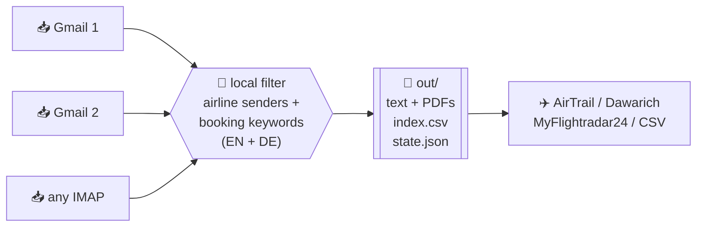

<div align="center">

# ✈️ Layover

**Turn a decade of airline emails into a flight log — self-hosted, no APIs, no browser.**

Layover scans your inbox over **IMAP**, finds every booking confirmation, e-ticket and
boarding pass, and hands you clean text you can import into [AirTrail](https://github.com/johanohly/AirTrail),
[Dawarich](https://github.com/Freika/dawarich), MyFlightradar24 or a spreadsheet.

[](LICENSE)
[](https://www.python.org/)
[](#)
[](#how-it-fits-airtrail--dawarich)

</div>

---

## Why Layover?

You've flown for years. The record of *where* is sitting in your email — hundreds of
booking confirmations and boarding passes across every account you've ever used. Airlines
don't give you an export, flight-tracker apps want you to retype it all by hand, and the
browser-driven "let an AI read my inbox" approach is slow and expensive.

**Layover reads the inbox directly and cheaply.** It fetches only message *headers* first,
filters them locally, and downloads the full body of the few that are actually flights — so a
mailbox of tens of thousands of messages costs one quick header sweep and a handful of full
fetches. Everything stays on your machine.



## Features

- 🗂️ **Multi-account** — sweep as many mailboxes as you like from one config.
- ⚡ **Incremental** — remembers what it has seen (per-folder UID watermark) and only pulls
  *new* mail on the next run. `--full` forces a complete re-scan.
- 🧾 **Text + PDFs** — saves the plain-text body *and* any PDF attachments (old boarding
  passes love to hide in PDFs).
- 🌍 **Bilingual filter** — matches English and German booking language out of the box, plus
  40+ airline and OTA sender domains.
- 🔒 **Local & private** — pure IMAP, read-only. Nothing leaves your machine; no third-party
  service ever sees your mail.
- 🪶 **Zero dependencies** — one file, Python 3.9+ standard library. Nothing to `pip install`.

## Quickstart

```bash
git clone https://github.com/YOUR-USERNAME/layover.git
cd layover

cp accounts.example.ini accounts.ini      # git-ignored
chmod 600 accounts.ini                     # holds real passwords
$EDITOR accounts.ini                       # fill in your mailboxes

python3 layover.py accounts.ini out/
```

Open `out/index.csv` for the list of hits, and `out/<account>/` for the saved emails.

Run it again next month and it only grabs what's new:

```bash
python3 layover.py accounts.ini out/          # incremental (default)
python3 layover.py accounts.ini out/ --full   # re-scan everything
```

## Configuration

One `[section]` per account:

```ini
[gmail]
host = imap.gmail.com
user = jane.doe@gmail.com
password = APP_PASSWORD          ; see "Two-factor auth" below
since = 01-Jan-2015              ; IMAP date format: dd-Mon-yyyy
before =                         ; empty = up to today
folders = auto                   ; auto = Gmail "All Mail" if present, else all folders
```

| Key        | Meaning                                                                      |
|------------|------------------------------------------------------------------------------|
| `host`     | IMAP server, e.g. `imap.gmail.com`, `imap.ionos.de`, `outlook.office365.com` |
| `user`     | Full email address                                                           |
| `password` | App password (Google) or mailbox password (IONOS & most others)              |
| `since`    | Earliest date to scan, `dd-Mon-yyyy`. Use `01-Jan-2000` for "everything"     |
| `before`   | Latest date, or empty for today                                              |
| `folders`  | `auto`, or a comma-separated list of folder names                            |

> On the **first** run Layover scans the whole `since … before` window. After that it ignores
> the dates and only fetches messages newer than the last one it saw (tracked in
> `out/state.json`). Delete `state.json` or pass `--full` to start over.

## Two-factor auth

IMAP has no interactive second-factor step, so Layover doesn't handle 2FA at runtime — you
give it a credential that already satisfies 2FA:

- **Gmail / Google Workspace (2-Step Verification on):** create a 16-character
  **[app password](https://myaccount.google.com/apppasswords)** and use it as `password`. The
  app password *is* the 2FA-satisfying credential, so there's no code prompt. It only appears
  once 2-Step Verification is enabled; each account needs its own.
- **IONOS / 1&1 and most other hosts:** the plain **mailbox password** works over IMAP. (Any
  2FA there guards the web control panel, not the mail protocol.)

Passwords may contain any character — `%`, `$`, `!` and friends are read literally.

## Output

```
out/
├── index.csv                  # one row per hit: account, folder, uid, date, from, subject, has_pdf, file
├── state.json                 # per-folder UID watermark (drives incremental runs)
├── gmail/
│   ├── 4821_Your-e-ticket-receipt-PP4G3A.txt
│   └── 4821_Your-e-ticket-receipt-PP4G3A_0.pdf
└── workspace/
    └── 1630_Ihre-Bordkarte-n.txt
```

Files are named by IMAP UID, so re-runs never clobber or duplicate earlier results.

## How it fits AirTrail & Dawarich

Layover produces the *raw material*; you (or an LLM) turn `index.csv` + the saved emails into
structured flights and post them to your tracker:

- **[AirTrail](https://github.com/johanohly/AirTrail)** — create a flight via
  `POST /api/flight/save`, or format the data as an AirTrail JSON / MyFlightradar24 CSV import.
- **[Dawarich](https://github.com/Freika/dawarich)** — its native AirTrail integration then
  draws your whole flight history as arcs on the map, alongside your location timeline.

## Roadmap & Contributing

Layover currently hands you raw text + PDFs; turning that into structured flights and getting
them into AirTrail is still a manual (or LLM-assisted) step. Where this is headed next:

- **Miles & More integration** — pull flight history directly from Miles & More alongside the
  inbox sweep, cross-checking against email hits for a more complete record.
- **Direct AirTrail push** — parse saved emails into structured flight data and POST them
  straight to AirTrail's `/api/flight/save`, closing the loop from inbox to tracker automatically.

This is a small, actively-developed project — suggestions, issues and pull requests are welcome.
Open one any time.

## Security

- `accounts.ini` holds real passwords and is **git-ignored**. Keep it `chmod 600`.
- `out/` contains your actual emails and PDFs and is **git-ignored** too — never commit it.
- Connections are IMAP-over-TLS (`IMAP4_SSL`, port 993) and **read-only** (`BODY.PEEK`,
  `readonly=True`): Layover never marks mail as read, moves it, or deletes anything.

## License

MIT — see [LICENSE](LICENSE).

---

<div align="center">
<sub>Keywords: self-hosted flight tracker · import flight history from email · IMAP boarding-pass
parser · AirTrail importer · Dawarich flights · e-ticket / booking-confirmation scraper · flight log.</sub>
</div>
