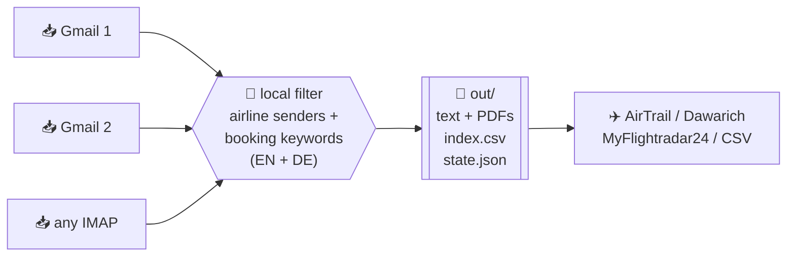
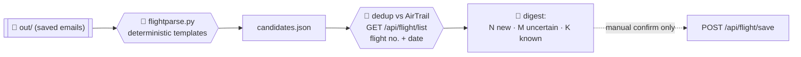

<div align="center">

# ✈️ Layover

**Turn a decade of airline emails into a flight log — self-hosted, no APIs, no browser.**

Layover scans your inbox over **IMAP**, finds every booking confirmation, e-ticket and
boarding pass, and hands you clean text you can import into [AirTrail](https://github.com/johanohly/AirTrail),
[Dawarich](https://github.com/Freika/dawarich), MyFlightradar24 or a spreadsheet.

[](LICENSE)
[](https://www.python.org/)
[](#)
[](#how-it-fits-airtrail--dawarich)

</div>

---

## Why Layover?

You've flown for years. The record of *where* is sitting in your email — hundreds of
booking confirmations and boarding passes across every account you've ever used. Airlines
don't give you an export, flight-tracker apps want you to retype it all by hand, and the
browser-driven "let an AI read my inbox" approach is slow and expensive.

**Layover reads the inbox directly and cheaply.** It fetches only message *headers* first,
filters them locally, and downloads the full body of the few that are actually flights — so a
mailbox of tens of thousands of messages costs one quick header sweep and a handful of full
fetches. Everything stays on your machine.



## Features

- 🗂️ **Multi-account** — sweep as many mailboxes as you like from one config.
- ⚡ **Incremental** — remembers what it has seen (per-folder UID watermark) and only pulls
  *new* mail on the next run. `--full` forces a complete re-scan.
- 🧾 **Text + PDFs** — saves the plain-text body *and* any PDF attachments (old boarding
  passes love to hide in PDFs).
- 🌍 **Bilingual filter** — matches English and German booking language out of the box, plus
  40+ airline and OTA sender domains.
- 🔒 **Local & private** — pure IMAP, read-only. Nothing leaves your machine; no third-party
  service ever sees your mail.
- 🪶 **Zero dependencies** — one file, Python 3.9+ standard library. Nothing to `pip install`.

## Quickstart

```bash
git clone https://github.com/YOUR-USERNAME/layover.git
cd layover

cp accounts.example.ini accounts.ini      # git-ignored
chmod 600 accounts.ini                     # holds real passwords
$EDITOR accounts.ini                       # fill in your mailboxes

python3 layover.py accounts.ini out/
```

Open `out/index.csv` for the list of hits, and `out/<account>/` for the saved emails.

Run it again next month and it only grabs what's new:

```bash
python3 layover.py accounts.ini out/          # incremental (default)
python3 layover.py accounts.ini out/ --full   # re-scan everything
```

## Configuration

One `[section]` per account:

```ini
[gmail]
host = imap.gmail.com
user = jane.doe@gmail.com
password = APP_PASSWORD          ; see "Two-factor auth" below
since = 01-Jan-2015              ; IMAP date format: dd-Mon-yyyy
before =                         ; empty = up to today
folders = auto                   ; auto = Gmail "All Mail" if present, else all folders
```

| Key        | Meaning                                                                      |
|------------|------------------------------------------------------------------------------|
| `host`     | IMAP server, e.g. `imap.gmail.com`, `imap.ionos.de`, `outlook.office365.com` |
| `user`     | Full email address                                                           |
| `password` | App password (Google) or mailbox password (IONOS & most others)              |
| `since`    | Earliest date to scan, `dd-Mon-yyyy`. Use `01-Jan-2000` for "everything"     |
| `before`   | Latest date, or empty for today                                              |
| `folders`  | `auto`, or a comma-separated list of folder names                            |

> On the **first** run Layover scans the whole `since … before` window. After that it ignores
> the dates and only fetches messages newer than the last one it saw (tracked in
> `out/state.json`). Delete `state.json` or pass `--full` to start over.

## Two-factor auth

IMAP has no interactive second-factor step, so Layover doesn't handle 2FA at runtime — you
give it a credential that already satisfies 2FA:

- **Gmail / Google Workspace (2-Step Verification on):** create a 16-character
  **[app password](https://myaccount.google.com/apppasswords)** and use it as `password`. The
  app password *is* the 2FA-satisfying credential, so there's no code prompt. It only appears
  once 2-Step Verification is enabled; each account needs its own.
- **IONOS / 1&1 and most other hosts:** the plain **mailbox password** works over IMAP. (Any
  2FA there guards the web control panel, not the mail protocol.)

Passwords may contain any character — `%`, `$`, `!` and friends are read literally.

## Output

```
out/
├── index.csv                  # one row per hit: account, folder, uid, date, from, subject, has_pdf, file
├── state.json                 # per-folder UID watermark (drives incremental runs)
├── gmail/
│   ├── 4821_Your-e-ticket-receipt-ABC123.txt
│   └── 4821_Your-e-ticket-receipt-ABC123_0.pdf
└── workspace/
    └── 1630_Ihre-Bordkarte-n.txt
```

Files are named by IMAP UID, so re-runs never clobber or duplicate earlier results.

## How it fits AirTrail & Dawarich

Layover produces the *raw material*; you (or an LLM) turn `index.csv` + the saved emails into
structured flights and post them to your tracker:

- **[AirTrail](https://github.com/johanohly/AirTrail)** — create a flight via
  `POST /api/flight/save`, or format the data as an AirTrail JSON / MyFlightradar24 CSV import.
- **[Dawarich](https://github.com/Freika/dawarich)** — its native AirTrail integration then
  draws your whole flight history as arcs on the map, alongside your location timeline.

## Auto-population (Phase 1) — parse, dedup, digest

Beyond the raw sweep, Layover ships a **deterministic** pipeline that turns saved emails into
candidate flights and tells you what's new — **without ever writing to AirTrail on its own**.
The design is *propose-then-approve*: a machine proposes, a human approves. A mis-parsed
cancellation or rebooking would quietly corrupt the map and stats, so nothing reaches the API
unreviewed.



Three extractors cover the formats that dominate the mailboxes and are stable enough to trust:

| Extractor    | Covers                                                    | How |
|--------------|-----------------------------------------------------------|-----|
| `jsonld`     | SWISS · Edelweiss · TAP · airBaltic check-in / boarding   | schema.org `FlightReservation` markup embedded in the email — airline, both airports, times, seat |
| `lh_checkin` | Lufthansa "Sie sind eingecheckt: LH1769, LCA-MUC, …"      | everything is in the subject line |
| `ba_eticket` | British Airways "Your Itinerary" / "Reiseplan" e-tickets  | itinerary block (EN one-field-per-line **and** DE concatenated); friendly airport names mapped to codes |

Each candidate is emitted as structured JSON with ICAO `from`/`to`, airline ICAO, canonical
`date`, local `departure`/`arrival`, `seatNumber` when present, `flightReason: "leisure"`, plus
provenance (`source_file`, `extractor`, `confidence`, `issues`). Airport/airline codes come from
a small offline table (`airdata.py`) — no network, no dependencies.

```bash
# parse only -> candidate JSON on stdout
python3 flightparse.py flight-mail-out/

# full weekly flow: (optional pull) -> parse -> dedup vs AirTrail -> digest
cp airtrail.example.ini airtrail.ini && chmod 600 airtrail.ini   # url + API key
python3 populate.py flight-mail-out/                    # digest only, never writes
python3 populate.py flight-mail-out/ --pull accounts.ini        # sweep first
python3 populate.py flight-mail-out/ --flights-json dump.json   # offline dedup, no key

# after reviewing the digest, write the NEW ones — asks 'yes' per flight:
python3 populate.py flight-mail-out/ --commit
```

The digest reports **N new, M uncertain, K already in AirTrail**, hides duplicates, and flags
**possible rebookings/cancellations** (same route + date, different flight number) — the classic
ghost-flight trap. Dedup normalises flight numbers (`BA0745` ≡ `BA745`) and matches on
flight number + date. If AirTrail is unreachable and no dump is given, candidates are still
produced and marked `unverified` rather than the run failing.

### Weekly cron

`cron/layover-weekly.sh` runs pull → parse → dedup → digest and logs to
`flight-mail-out/weekly.log`; set `NOTIFY_CMD` to pipe the digest to Telegram/mail. Install it with
**systemd** (`cron/layover-weekly.{service,timer}`, Mondays 07:00) on Linux, **launchd**
(`cron/de.gemmingen.layover.weekly.plist`) on macOS, or a one-line crontab. It runs in
digest-only mode — writes stay manual.

### Run in Docker (recommended for an always-on box)

For a set-and-forget deployment, run Layover as a long-lived container that schedules
itself — no host cron, no `pip install` (the image is pure-stdlib Python). It fires weekly
(Mondays 07:00 by default), pulls new mail incrementally, and logs the digest. It **never**
writes to AirTrail.

```bash
cp .env.example .env             # AirTrail URL + API key, timezone, schedule
cp accounts.example.ini accounts.ini
chmod 600 .env accounts.ini      # both hold secrets — git-ignored
$EDITOR .env accounts.ini

docker compose up -d --build
docker compose logs -f layover   # watch the digest (also written to /data/candidates.json)
```

- **Scheduling** is a tiny stdlib loop (`scheduler.py`) — next `SCHEDULE_DOW`/`HOUR`/`MINUTE`
  in local time (DST-aware via `TZ`), then sleep. `RUN_ON_START=true` also runs once on
  `up` so you get an immediate digest to confirm config. `restart: unless-stopped` keeps it
  alive across reboots.
- **State persists** in the named volume `layover-data` (`/data`) — the per-folder UID
  watermark (`state.json`) lives there, so each weekly run stays incremental and cheap.
- **Networking** uses `network_mode: host` so the container reaches AirTrail at
  `http://airtrail-host:3006` over tailnet MagicDNS (the exact name its `ORIGIN` expects) and does
  outbound IMAP. On a non-tailnet host, drop `network_mode` and add an `extra_hosts` entry.
- **Secrets:** `accounts.ini` mounts read-only; the AirTrail key comes from `.env`. Neither is
  baked into the image (see `.dockerignore`) or committed.

Writes stay manual and interactive — after reviewing a digest:

```bash
docker compose exec layover python3 populate.py /data --commit   # asks yes per flight
```

### Tests

```bash
python3 -m unittest discover -s tests    # parser contract, dedup, key normalisation
```

## Roadmap & Contributing

Phase 1 (above) is deterministic templates + digest, no LLM in the loop. Where this is headed:

- **Phase 2 — local-LLM fallback** for the long tail (Ryanair, Wizz, LATAM, OTAs) whose emails
  have no stable structured markup. Still behind the same human-confirm gate.
- **Phase 3 — location-history validation:** cross-check candidates against
  [Dawarich](https://github.com/Freika/dawarich) point history to auto-confirm a flight or flag a
  cancelled/rebooked one (the signal a phone app gets, self-hosted).
- **Miles & More** stays a periodic manual cross-check — highest-precision source, used as a
  completeness checksum, not the engine.

This is a small, actively-developed project — suggestions, issues and pull requests are welcome.
Open one any time.

## Security

- `accounts.ini` holds real passwords and is **git-ignored**. Keep it `chmod 600`.
- `airtrail.ini` holds the AirTrail API key and is **git-ignored** too (`chmod 600`); the key can
  also come from `AIRTRAIL_URL` / `AIRTRAIL_API_KEY` in the environment.
- `out/` (and `flight-mail-out/`, `candidates.json`) contain your actual emails and flight data and
  are **git-ignored** — never commit them.
- Connections are IMAP-over-TLS (`IMAP4_SSL`, port 993) and **read-only** (`BODY.PEEK`,
  `readonly=True`): Layover never marks mail as read, moves it, or deletes anything.

## License

MIT — see [LICENSE](LICENSE).

## Collaboration roadmap

Features are built **one per branch** (`feature/<name>`), **test-first**: the tests listed
below must pass (`python3 -m unittest discover -s tests`) before a feature is ticked and its
pull request merged. Requests from early users land at the bottom.

**Done**

- [x] **Deterministic parser** — Lufthansa / SWISS / BA emails → candidate flights.
  <br>_Tests:_ `tests/test_flightparse.py` — JSON-LD, LH "eingecheckt", BA e-ticket, seat parse.
- [x] **Weekly digest, never auto-writes** — parse → dedup vs AirTrail → "N new, M uncertain".
  <br>_Tests:_ dedup key normalisation (`BA0745`≡`BA745`), classify new/duplicate, rebooking flag.
- [x] **Docker Compose deployment** — self-scheduling stdlib container, state persisted in a volume.
  <br>_Tests:_ `scheduler.next_run` boundary cases; `docker compose config` parses.

**Next**

- [ ] **Continuous scan every X minutes** — interval mode beside the weekly slot (`SCHEDULE_MODE=interval`, `SCAN_INTERVAL_MINUTES`).
  <br>_Tests:_ interval picks the next slot; env parsing; weekly mode unchanged.
- [ ] **Notification / webhook on new flight** — optional POST (or Telegram) when a candidate is `new`.
  <br>_Tests:_ fires only for `new` (not duplicate/uncertain); payload shape; no-op when unset.
- [ ] **Automatic add to AirTrail** — opt-in auto-write for high-confidence, non-rebooking candidates.
  <br>_Tests:_ only `high` written; rebooking/cancelled skipped; dry-run is the default.
- [ ] **Local-LLM fallback (Phase 2)** — long tail (Ryanair / Wizz / LATAM / OTAs).
- [ ] **Dawarich location validation (Phase 3)** — confirm/refute a candidate via point history.

**Requested by early users**

- Continuous every-X-minutes scan — _an early user_
- Docker Compose — _an early user_ ✅
- Automatic flight add — _an early user_ (see "Automatic add to AirTrail")
- Notification / webhook on new flight — _an early user_

---

<div align="center">
<sub>Keywords: self-hosted flight tracker · import flight history from email · IMAP boarding-pass
parser · AirTrail importer · Dawarich flights · e-ticket / booking-confirmation scraper · flight log.</sub>
</div>
